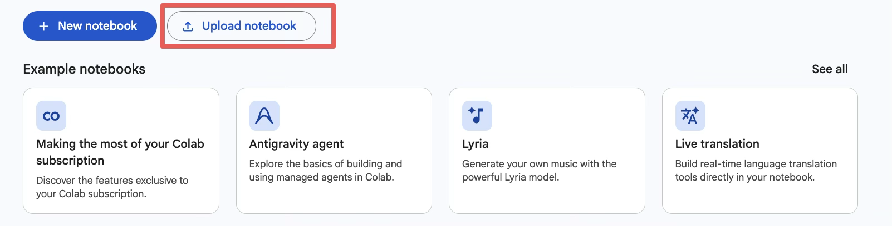
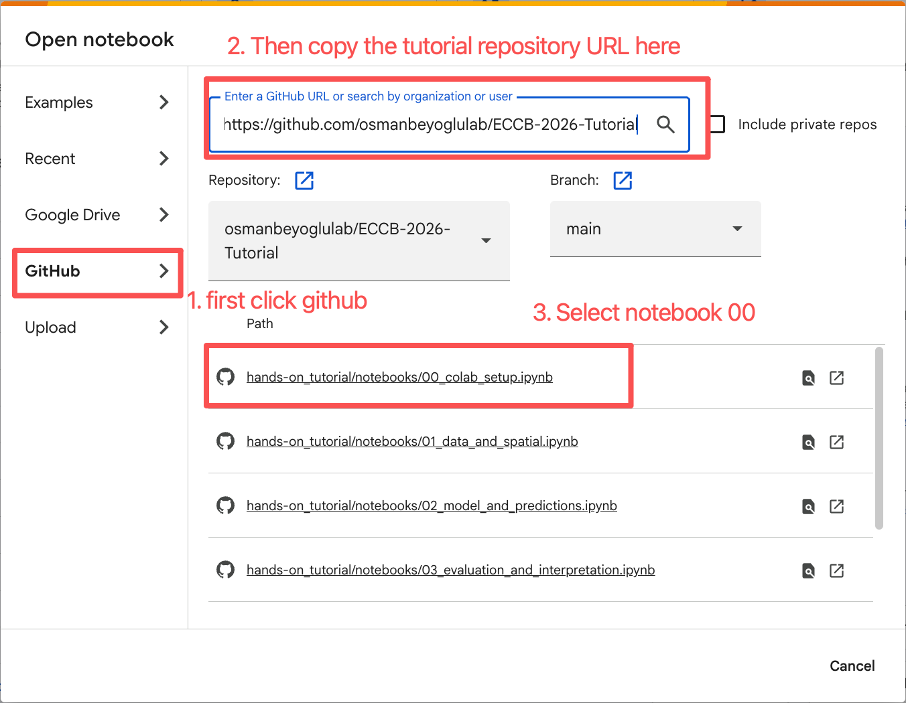

# Participant Preparation

Welcome to the ECCB 2026 tutorial, **Computational Inference of Spatial Protein Landscapes: Methods, Assumptions, and Pitfalls**.

The hands-on tutorial demonstrates two stages of the DGAT workflow:

- **Model training and evaluation:** Sessions 1–2 use paired human tonsil data generated with the **10x Genomics Visium CytAssist Gene and Protein Expression platform**. The dataset contains spatially matched RNA expression and antibody-derived tag (ADT) measurements for 31 proteins.
- **Protein inference and interpretation:** Session 3 uses the transcriptome-only **10x Genomics Visium human lymph node** sample (`V1_Human_Lymph_Node`) to infer spatial protein abundance with a pretrained DGAT model.

> **Important:** Complete [Notebook 0 — Prepare Google Drive](https://colab.research.google.com/github/osmanbeyoglulab/ECCB-2026-Tutorial/blob/main/hands-on_tutorial/notebooks/00_colab_setup.ipynb) before the tutorial. Run every cell and keep the prepared `ECCB2026` folder in Google Drive.

The tutorial runs entirely in **Google Colab**. You do not need to install Python, Conda, Jupyter, DGAT, CUDA, or any Python packages on your laptop. A GPU is not required for the default participant workflow. Session 3 includes full lymph node inference as an optional GPU-based reproducibility exercise.

## What to prepare

- A laptop with a current version of Chrome, Safari, Firefox, or Edge
- A Google account with access to Google Drive and Google Colab
- At least 3 GB of free space in Google Drive
- A stable internet connection for the initial data download
- Your laptop charger
- Your Google two-factor authentication method, if enabled
- A mouse, if desired, for easier notebook navigation

## Complete this once before the tutorial

1. **Sign in.** Open the Google account and Drive that you will use during the tutorial.
2. **Open Notebook 0.** Use this direct Colab link:
   [Notebook 0 — Prepare Google Drive](https://colab.research.google.com/github/osmanbeyoglulab/ECCB-2026-Tutorial/blob/main/hands-on_tutorial/notebooks/00_colab_setup.ipynb).
3. **Select the runtime.** Choose **Runtime → Change runtime type → 2026.04 (Python 3.12)**.
   Use this same runtime version for Sessions 1–3.
4. **Run the notebook from top to bottom.** Choose **Run all** and approve the Google Drive mount
   when prompted.
5. **Wait for the completion message.** The final cell should print
   `Drive preparation complete: /content/drive/MyDrive/ECCB2026`.
6. **Keep the prepared folder.** Do not rename or delete `MyDrive/ECCB2026` before or during the
   tutorial. You may close the Colab runtime after preparation; the files remain in Drive.

### Opening Notebook 0 from the Colab home page

The direct Notebook 0 link above is the quickest option. If you are starting from the
[Google Colab home page](https://colab.research.google.com/), follow these steps instead:

1. Select **Upload notebook** to open the notebook picker.

   

2. Select **GitHub**, paste
   `https://github.com/osmanbeyoglulab/ECCB-2026-Tutorial` into the search box, confirm that the
   branch is **main**, and select
   `hands-on_tutorial/notebooks/00_colab_setup.ipynb`.

   

## What Notebook 0 prepares

- The paired Tonsil RNA and measured ADT files used in Sessions 1–2
- The 10x `V1_Human_Lymph_Node` count matrix and spatial/H&E bundle, tracked germinal-center
  annotation, and organizer-validated precomputed DGAT prediction matrix used in Session 3
- A combined asset manifest containing dataset roles, file sizes, and SHA-256 checksums
- A Python wheel cache matched to the selected Colab/Python version, reducing later package setup
  time
- Persistent folders for processed data, results, figures, and completion checkpoints under
  `MyDrive/ECCB2026/state`

Please do not download these dataset files manually. Notebook 0 places them in the correct Drive
folders and verifies them automatically.

**Resource estimate:** Notebook 0 takes approximately 5–10 minutes. Allow 5–15 minutes each for
Sessions 1–2 and 3–5 minutes for the default Session 3 workflow on CPU (about 12 GB system RAM; no
GPU). Allow 3 GB of Drive space. Optional full inference takes approximately 15–30 minutes including
setup and should use at least 12 GB system RAM and 8 GB GPU RAM. Colab allocations vary, so these
are planning estimates rather than guarantees.

## During the workshop

Open notebooks with the direct links below. Do not open `.ipynb` files from Colab's `/content`
Files pane; that pane may show a source preview instead of an executable notebook.

1. [Session 1 — Data and spatial context](https://colab.research.google.com/github/osmanbeyoglulab/ECCB-2026-Tutorial/blob/main/hands-on_tutorial/notebooks/01_data_and_spatial.ipynb):
   paired Tonsil RNA/ADT quality control, normalization, spatial neighborhoods, and exploratory
   structure
2. [Session 2 — Model and predictions](https://colab.research.google.com/github/osmanbeyoglulab/ECCB-2026-Tutorial/blob/main/hands-on_tutorial/notebooks/02_model_and_predictions.ipynb):
   paired Tonsil graph construction, DGAT architecture and objective, and validated Tonsil
   predictions
3. [Session 3 — Lymph-node inference and interpretation](https://colab.research.google.com/github/osmanbeyoglulab/ECCB-2026-Tutorial/blob/main/hands-on_tutorial/notebooks/03_evaluation_and_interpretation.ipynb):
   validated precomputed predictions, germinal-center-associated marker maps and clusters, and
   spatial coherence

Run the first bootstrap cell whenever a notebook receives a new runtime. It mounts Drive,
refreshes the tutorial checkout, copies only the dataset required by that notebook to fast local
storage, installs the pinned packages, and reconnects saved checkpoints. Sessions 1–2 copy Tonsil;
Session 3 independently copies lymph node.

## If the runtime disconnects

1. Reopen the same notebook from its direct Colab link.
2. Confirm runtime version 2026.04.
3. Rerun the first bootstrap cell.
4. Read the printed checkpoints and continue from the first unfinished part.

Do not repeat Notebook 0 or redownload the dataset unless the notebook reports that a Drive asset
is missing or incomplete.

## Troubleshooting

- **Notebook shows `<undefined>` or raw source:** close the Files-pane preview and use the direct
  Colab link above.
- **Missing Drive asset:** rerun Notebook 0. Complete files are skipped, and interrupted downloads
  resume when supported.
- **`ModuleNotFoundError: dgat_tutorial`:** rerun the first bootstrap cell in the current notebook.
- **Runtime reset:** rerun only the bootstrap, then continue from the first unfinished checkpoint.
- **Wrong dataset:** Sessions 1–2 require paired `Tonsil_RNA.h5ad` and `Tonsil_ADT.h5ad`;
  Session 3 requires `V1_Human_Lymph_Node` RNA, spatial, GC-label, and prediction assets.
- **`muon`/`mudata` import error:** rerun the first bootstrap cell so the compatible pinned versions
  are installed, then restart the runtime if Colab requests it.
- **Optional full inference:** use a GPU runtime and enable the clearly labeled flag at the end of
  Session 3. It is not required for the participant workflow.

## Useful links

- [ECCB 2026 tutorial repository](https://github.com/osmanbeyoglulab/ECCB-2026-Tutorial) — slides,
  notebooks, and all tutorial resources
- [Participant setup guide](https://github.com/osmanbeyoglulab/ECCB-2026-Tutorial/blob/main/hands-on_tutorial/PARTICIPANT_SETUP.md) —
  the latest preparation and troubleshooting instructions
- [Official DGAT repository](https://github.com/osmanbeyoglulab/DGAT) — upstream software and
  research implementation; installation is not required for the tutorial

## Before you arrive: final checklist

- [ ] I can sign in to the Google account I will use during the tutorial.
- [ ] Notebook 0 finished with the Drive preparation completion message.
- [ ] `MyDrive/ECCB2026` exists and has not been renamed or deleted.
- [ ] I have my laptop, charger, and any required two-factor authentication device.

Completing Notebook 0 before the workshop will let us spend the live session on the science,
modeling assumptions, evaluation, and interpretation rather than large downloads.
